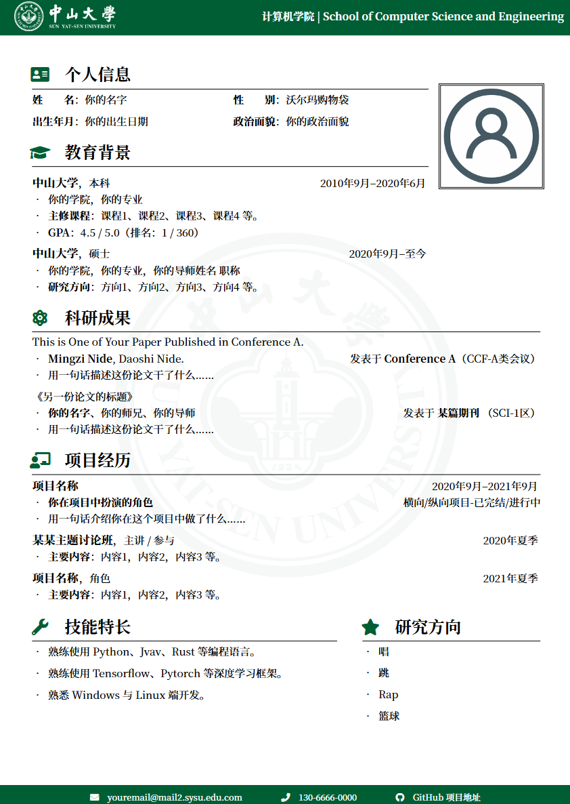

# SYSU-CV：中山大学 LaTeX 中文简历模板

## 简介

基于 [SEU 中文 CV 模板](https://www.overleaf.com/latex/templates/whuwu-han-da-xue-zhong-wen-jian-li-mo-ban/dbkvxrqjmzpd)

在原有内容的基础上进行了修改：

- 更改了页眉页脚，不必再加载页眉页脚图片而是按照RGB生成矩形块，方便了后续其他院校按照院校主题色修改页眉页脚颜色。
- 更改了校徽图标（参考 https://www.overleaf.com/latex/templates/sysu-beamer-unofficial-template/zqbdzvrgkwvw）
- 调整了装饰图案的色彩风格

## 使用方法

- 编辑 `main.tex` 中的内容，对文档样式和内容进行修改。
- 使用 `XeLaTeX` 或 `LuaLaTeX` 编译。
